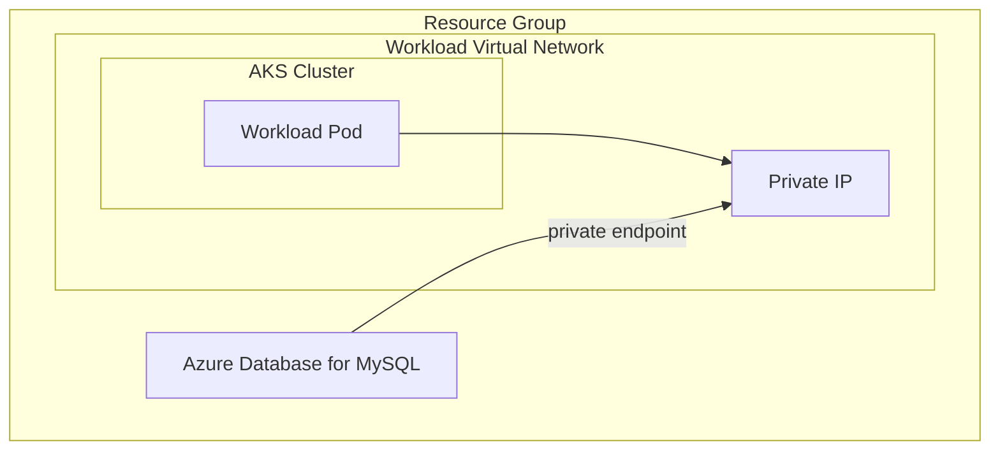
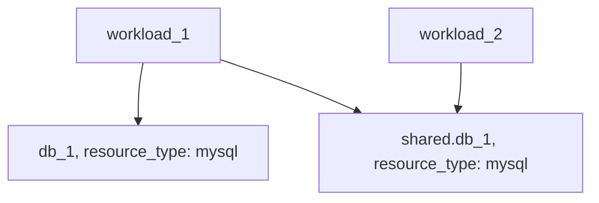

# Example: mysql resource based on Azure Database for MySQL

## Configuration

This example configures a [mysql](https://developer.humanitec.com/platform-orchestrator/reference/resource-types/#mysql) Resource Definition using Azure Database for MySQL.

The created definition can be used in your Score file using:

```yaml
resources:
  ...
  db:
    type: mysql
```

## Infrastructure setup



## Orchestrator setup



## Terraform docs

<!-- BEGIN_TF_DOCS -->
### Requirements

| Name | Version |
|------|---------|
| terraform | >= 1.3.0 |
| azuread | ~> 2.47 |
| azurerm | ~> 3.91 |
| humanitec | ~> 1.0 |

### Providers

| Name | Version |
|------|---------|
| azuread | ~> 2.47 |
| azurerm | ~> 3.91 |
| humanitec | ~> 1.0 |

### Modules

| Name | Source | Version |
|------|--------|---------|
| mysql | ../../humanitec-resource-defs/mysql/basic | n/a |

### Resources

| Name | Type |
|------|------|
| [azuread_application.humanitec_provisioner](https://registry.terraform.io/providers/hashicorp/azuread/latest/docs/resources/application) | resource |
| [azuread_service_principal.humanitec_provisioner](https://registry.terraform.io/providers/hashicorp/azuread/latest/docs/resources/service_principal) | resource |
| [azuread_service_principal_password.humanitec_provisioner](https://registry.terraform.io/providers/hashicorp/azuread/latest/docs/resources/service_principal_password) | resource |
| [azurerm_role_assignment.resource_group](https://registry.terraform.io/providers/hashicorp/azurerm/latest/docs/resources/role_assignment) | resource |
| [humanitec_application.example](https://registry.terraform.io/providers/humanitec/humanitec/latest/docs/resources/application) | resource |
| [humanitec_resource_account.humanitec_provisioner](https://registry.terraform.io/providers/humanitec/humanitec/latest/docs/resources/resource_account) | resource |
| [humanitec_resource_definition_criteria.mysql](https://registry.terraform.io/providers/humanitec/humanitec/latest/docs/resources/resource_definition_criteria) | resource |
| [azurerm_resource_group.main](https://registry.terraform.io/providers/hashicorp/azurerm/latest/docs/data-sources/resource_group) | data source |

### Inputs

| Name | Description | Type | Default | Required |
|------|-------------|------|---------|:--------:|
| administrator\_login | The Administrator login for the MySQL Server. | `string` | n/a | yes |
| administrator\_login\_password | The Password associated with the administrator\_login for the MySQL Server. | `string` | n/a | yes |
| resource\_group\_name | Specifies the Name of the Resource Group within which this database will reside. | `string` | n/a | yes |
| subnet\_name | The name of the Subnet from which Private IP Addresses will be allocated for this Private Endpoint. | `string` | n/a | yes |
| subscription\_id | The Subscription ID which should be used. | `string` | n/a | yes |
| virtual\_network\_name | The name of the virtual network where Private Endpoint will be allocated. | `string` | n/a | yes |
| virtual\_network\_resource\_group\_name | Specifies the Name of the Resource Group within which the Private Endpoint should exist. | `string` | n/a | yes |
| name | Name of the example application. | `string` | `"hum-rp-mysql-example"` | no |
| prefix | Prefix of the created resources | `string` | `"hum-rp-mysql-ex-"` | no |
| resource\_packs\_azure\_rev | Azure Resource Pack git branch. | `string` | `"refs/heads/main"` | no |
| resource\_packs\_azure\_url | Azure Resource Pack git url. | `string` | `"https://github.com/humanitec-architecture/resource-packs-azure.git"` | no |
<!-- END_TF_DOCS -->
