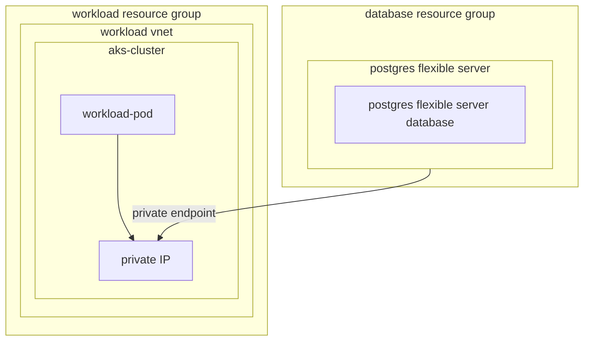
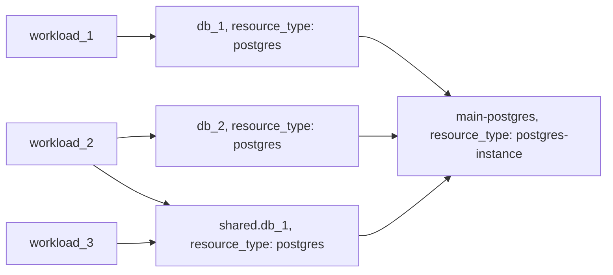

# Example: postgres resource based on Azure Database for PostgresSQL

---

Using this examples requires the "Enable Private Endpoints for PostgreSQL flexible servers" [preview feature to be enabled](https://learn.microsoft.com/en-us/azure/azure-resource-manager/management/preview-features).

---

## Configuration

This example configures a [postgres-instance](https://developer.humanitec.com/platform-orchestrator/reference/resource-types/#postgres-instance) and [postgres](https://developer.humanitec.com/platform-orchestrator/reference/resource-types/#postgres)  Resource Definition using Azure Database for PostgresSQL - Flexible Server.

The `postgres-instance` represent the actual server and is provisioned only once for the entire environment.

Workloads use the `postgres` resource to dynamically create databases on this server, the
respective score definition would look like:

```yaml
resources:
  ...
  db:
    type: postgres
```

## Infrastructure setup



## Orchestrator setup



<!-- BEGIN_TF_DOCS -->
## Requirements

| Name | Version |
|------|---------|
| terraform | >= 1.3.0 |
| azuread | ~> 2.47 |
| azurerm | ~> 3.91 |
| humanitec | ~> 1.0 |

## Providers

| Name | Version |
|------|---------|
| azuread | ~> 2.47 |
| azurerm | ~> 3.91 |
| humanitec | ~> 1.0 |

## Modules

| Name | Source | Version |
|------|--------|---------|
| postgres | ../../humanitec-resource-defs/postgres/basic | n/a |
| postgres\_instance | ../../humanitec-resource-defs/postgres-instance/basic | n/a |

## Resources

| Name | Type |
|------|------|
| [azuread_application.humanitec_provisioner](https://registry.terraform.io/providers/hashicorp/azuread/latest/docs/resources/application) | resource |
| [azuread_service_principal.humanitec_provisioner](https://registry.terraform.io/providers/hashicorp/azuread/latest/docs/resources/service_principal) | resource |
| [azuread_service_principal_password.humanitec_provisioner](https://registry.terraform.io/providers/hashicorp/azuread/latest/docs/resources/service_principal_password) | resource |
| [azurerm_role_assignment.resource_group_resource](https://registry.terraform.io/providers/hashicorp/azurerm/latest/docs/resources/role_assignment) | resource |
| [azurerm_role_assignment.resource_group_workload](https://registry.terraform.io/providers/hashicorp/azurerm/latest/docs/resources/role_assignment) | resource |
| [humanitec_application.example](https://registry.terraform.io/providers/humanitec/humanitec/latest/docs/resources/application) | resource |
| [humanitec_resource_account.humanitec_provisioner](https://registry.terraform.io/providers/humanitec/humanitec/latest/docs/resources/resource_account) | resource |
| [humanitec_resource_definition_criteria.postgres](https://registry.terraform.io/providers/humanitec/humanitec/latest/docs/resources/resource_definition_criteria) | resource |
| [humanitec_resource_definition_criteria.postgres_instance](https://registry.terraform.io/providers/humanitec/humanitec/latest/docs/resources/resource_definition_criteria) | resource |
| [azurerm_resource_group.resource](https://registry.terraform.io/providers/hashicorp/azurerm/latest/docs/data-sources/resource_group) | data source |
| [azurerm_resource_group.workload](https://registry.terraform.io/providers/hashicorp/azurerm/latest/docs/data-sources/resource_group) | data source |

## Inputs

| Name | Description | Type | Default | Required |
|------|-------------|------|---------|:--------:|
| resource\_group\_name | Specifies the Name of the Resource Group within which this database will reside. | `string` | n/a | yes |
| subnet\_name | The name of the subnet where the Private Endpoint will be allocated. | `string` | n/a | yes |
| subscription\_id | The Subscription ID which should be used. | `string` | n/a | yes |
| virtual\_network\_name | The name of the virtual network where Private Endpoint will be allocated. | `string` | n/a | yes |
| workload\_resource\_group\_name | The name of the resource group where the Private Endpoint will be allocated. | `string` | n/a | yes |
| administrator\_login | The Administrator login for the PostgreSQL Server. | `string` | `""` | no |
| administrator\_password | The Password associated with the administrator\_login for the PostgreSQL Server. | `string` | `""` | no |
| name | Name of the example application. | `string` | `"hum-rp-postgres-example"` | no |
| prefix | Prefix of the created resources | `string` | `"hum-rp-postgres-ex-"` | no |
| resource\_packs\_azure\_rev | Azure Resource Pack git branch. | `string` | `"refs/heads/main"` | no |
| resource\_packs\_azure\_url | Azure Resource Pack git url. | `string` | `"https://github.com/humanitec-architecture/resource-packs-azure.git"` | no |
<!-- END_TF_DOCS -->
