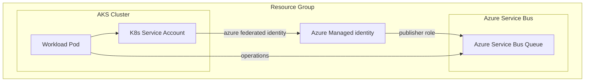
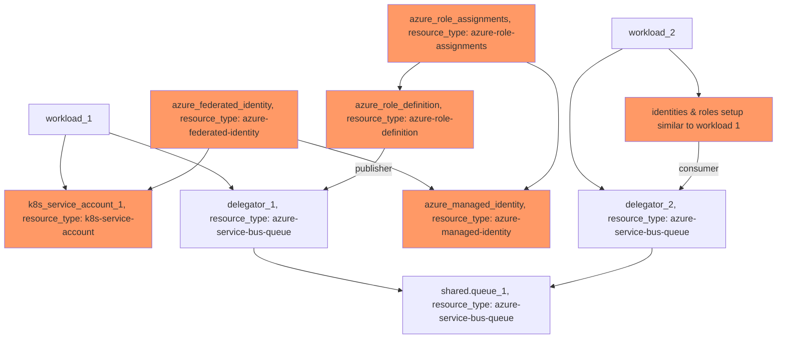

---
features:
- workload-identity
- multiple-access-classes
--- 

# Example: azure-service-bus-queue resource based on Azure Service Bus Queue

## Configuration

This example configures a [azure-service-bus-queue](https://developer.humanitec.com/platform-orchestrator/reference/resource-types/#azure-service-bus-queue) Resource Definition using Azure Service Bus, with two different access policies:

* `basic-publisher` (allowed to send messages)
* `basic-consumer` (allowed to receive messages)

Those Resource Definitions can be used in your Score file using:

```yaml
resources:
  ...
  queue:
    type: azure-service-bus-queue
    class: basic-publisher
```

## Infrastructure setup

The workload service account will automatically be assigned the necessary Azure Role.



## Orchestrator setup

The Resource Graph is using [delegator resources](https://developer.humanitec.com/platform-orchestrator/examples/resource-graph-patterns/#delegator-resource) to expose shared resources with different access policies.



## Terraform docs

<!-- BEGIN_TF_DOCS -->
### Requirements

| Name | Version |
|------|---------|
| terraform | >= 1.3.0 |
| azuread | ~> 2.47 |
| azurerm | ~> 3.91 |
| humanitec | ~> 1.0 |

### Providers

| Name | Version |
|------|---------|
| azuread | ~> 2.47 |
| azurerm | ~> 3.91 |
| humanitec | ~> 1.0 |

### Modules

| Name | Source | Version |
|------|--------|---------|
| federated\_identity | ../../humanitec-resource-defs/azure-federated-identity/basic | n/a |
| k8s\_service\_account | ../../humanitec-resource-defs/k8s/service-account | n/a |
| managed\_identity | ../../humanitec-resource-defs/azure-managed-identity/basic | n/a |
| role\_assignment | ../../humanitec-resource-defs/azure-role-assignments/basic | n/a |
| role\_definition\_consumer | ../../humanitec-resource-defs/azure-role-definition/echo | n/a |
| role\_definition\_publisher | ../../humanitec-resource-defs/azure-role-definition/echo | n/a |
| service\_bus | ../../humanitec-resource-defs/azure-service-bus-queue/basic | n/a |
| service\_bus\_consumer | ../../humanitec-resource-defs/azure-service-bus-queue/delegator | n/a |
| service\_bus\_publisher | ../../humanitec-resource-defs/azure-service-bus-queue/delegator | n/a |
| workload | ../../humanitec-resource-defs/workload/service-account | n/a |

### Resources

| Name | Type |
|------|------|
| [azuread_application.humanitec_provisioner](https://registry.terraform.io/providers/hashicorp/azuread/latest/docs/resources/application) | resource |
| [azuread_service_principal.humanitec_provisioner](https://registry.terraform.io/providers/hashicorp/azuread/latest/docs/resources/service_principal) | resource |
| [azuread_service_principal_password.humanitec_provisioner](https://registry.terraform.io/providers/hashicorp/azuread/latest/docs/resources/service_principal_password) | resource |
| [azurerm_role_assignment.resource_group_workload](https://registry.terraform.io/providers/hashicorp/azurerm/latest/docs/resources/role_assignment) | resource |
| [humanitec_application.example](https://registry.terraform.io/providers/humanitec/humanitec/latest/docs/resources/application) | resource |
| [humanitec_resource_account.humanitec_provisioner](https://registry.terraform.io/providers/humanitec/humanitec/latest/docs/resources/resource_account) | resource |
| [humanitec_resource_definition_criteria.federated_identity](https://registry.terraform.io/providers/humanitec/humanitec/latest/docs/resources/resource_definition_criteria) | resource |
| [humanitec_resource_definition_criteria.k8s_service_account](https://registry.terraform.io/providers/humanitec/humanitec/latest/docs/resources/resource_definition_criteria) | resource |
| [humanitec_resource_definition_criteria.managed_identity](https://registry.terraform.io/providers/humanitec/humanitec/latest/docs/resources/resource_definition_criteria) | resource |
| [humanitec_resource_definition_criteria.role_assignment](https://registry.terraform.io/providers/humanitec/humanitec/latest/docs/resources/resource_definition_criteria) | resource |
| [humanitec_resource_definition_criteria.role_definition_consumer](https://registry.terraform.io/providers/humanitec/humanitec/latest/docs/resources/resource_definition_criteria) | resource |
| [humanitec_resource_definition_criteria.role_definition_publisher](https://registry.terraform.io/providers/humanitec/humanitec/latest/docs/resources/resource_definition_criteria) | resource |
| [humanitec_resource_definition_criteria.service_bus](https://registry.terraform.io/providers/humanitec/humanitec/latest/docs/resources/resource_definition_criteria) | resource |
| [humanitec_resource_definition_criteria.service_bus_consumer](https://registry.terraform.io/providers/humanitec/humanitec/latest/docs/resources/resource_definition_criteria) | resource |
| [humanitec_resource_definition_criteria.service_bus_publisher](https://registry.terraform.io/providers/humanitec/humanitec/latest/docs/resources/resource_definition_criteria) | resource |
| [humanitec_resource_definition_criteria.workload](https://registry.terraform.io/providers/humanitec/humanitec/latest/docs/resources/resource_definition_criteria) | resource |
| [azurerm_resource_group.main](https://registry.terraform.io/providers/hashicorp/azurerm/latest/docs/data-sources/resource_group) | data source |

### Inputs

| Name | Description | Type | Default | Required |
|------|-------------|------|---------|:--------:|
| aks\_cluster\_issuer\_url | AKS OIDC Issuer URL | `string` | n/a | yes |
| resource\_group\_name | Specifies the Name of the Resource Group within which created resources will reside. | `string` | n/a | yes |
| subscription\_id | The Subscription ID which should be used. | `string` | n/a | yes |
| name | Specifies the Name for created example application. | `string` | `"hum-rp-service-bus-example"` | no |
| prefix | Specifies the prefix used in default name for created resources. | `string` | `"hum-rp-service-bus-ex-"` | no |
| resource\_packs\_azure\_rev | Azure Resource Pack git branch. | `string` | `"refs/heads/main"` | no |
| resource\_packs\_azure\_url | Azure Resource Pack git url. | `string` | `"https://github.com/humanitec-architecture/resource-packs-azure.git"` | no |
| sku | Defines which tier to use. | `string` | `"Standard"` | no |
<!-- END_TF_DOCS -->
